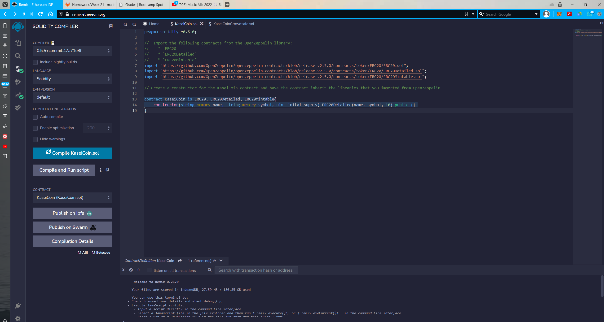
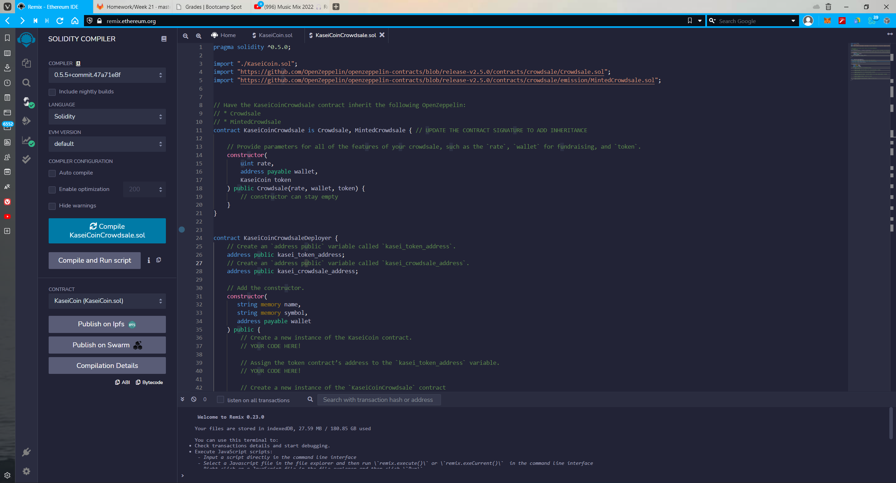
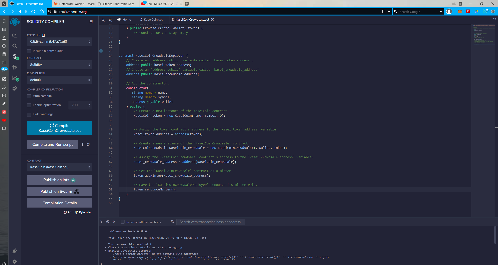
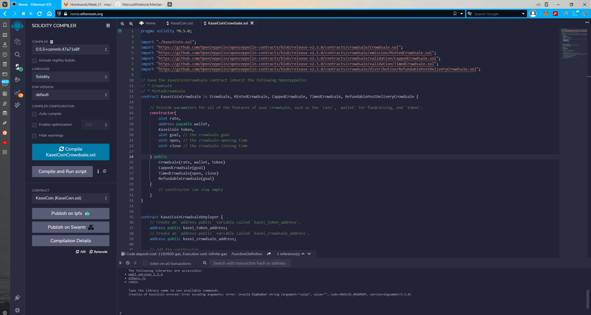
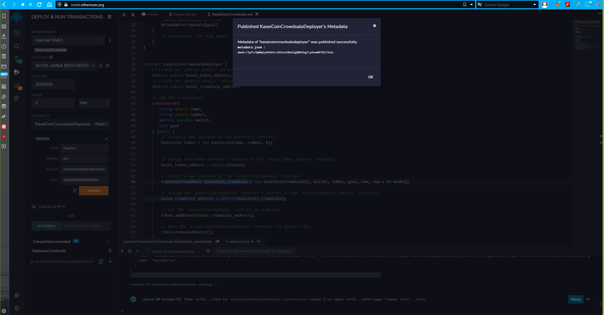
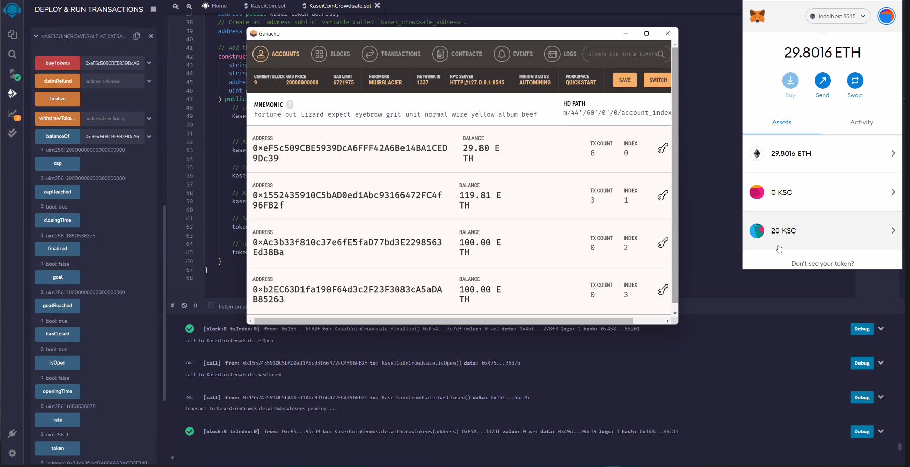

# Martian Token Crowdsale

## Background

After waiting for years and passing several tests, the Martian Aerospace Agency selected you to become part of the first human colony on Mars. As a prominent fintech professional, they chose you to lead a project developing a monetary system for the new Mars colony. You decided to base this new system on blockchain technology and to define a new cryptocurrency named **KaseiCoin**. (Kasei means Mars in Japanese.)

KaseiCoin will be a fungible token that’s ERC-20 compliant. You’ll launch a crowdsale that will allow people who are moving to Mars to convert their earthling money to KaseiCoin.

---

## Files

Download the following files to help you get started:

[KaseiCoin.sol](./Starter_Code/KaseiCoin.sol)

[KaseiCoinCrowdsale.sol](./Starter_Code/KaseiCoinCrowdsale.com)

--- 
## Instructions

Compile and deploy the contract then complete the following steps:

- Send ether to the crowdsale from a different account (that is, not the same account that’s raising funds). Then, once you confirm that the crowdsale works as expected, try to add the token to your wallet and to test a transaction.

- Set the close time to now + 5 minutes (for a shorter crowdsale) or to any timeline that you'd like to test.

- When sending ether to the contract, make sure that you meet the goal of the contract. Then finalize the sale by using the finalize function of the Crowdsale contract. Note that to finalize the sale, isOpen must return false (isOpen comes from TimedCrowdsale and checks whether the close time has passed). If you set the goal to 300 ether, for example, you might need to have multiple accounts buy tokens to meet the goal. If you run out of prefunded accounts in Ganache, you can create a new workspace.

- Review your tokens in MetaMask. To do so in MetaMask, click Add Token, click Custom Token, and then enter the address of the token contract. Make sure to buy larger amounts of tokens to get the denomination to appear in your wallet as more than a few wei worth.
---
## Step by Step Instructions
1. Clone the repo to your device 
2. Take the code and create identical files on Remix 
3. Compile both with compiler 0.5.5 
4. Then open Ganache and import the first two wallet addresses into two seperate accounts on Metamask 
5. In remix deploy environment choose injected web3 it will connect to the connected Metamask wallet 
6. Then choose the contract KaseiCoinCrowdsaleDeployer and enter the coin name, symbol, the connected wallet address and the goal in wei e.g 10000000000000000000 wei which equals 10 ether. Press transact or deploy and confirm on Metamask. 
7. Open deployed contract and press the first blue button that says kasei_crowdsale then copy that address it gives. 
8. Change the contract to KaseiCoinCrowdsale and paste the address into At Address and click At Address this will deploy the new contract. 
9. Then open the deployed contract KASEICOINCROWDSALE. 
10. Go to Metamask and connect the second account from ganache that you imported. Copy the address from it and paste it in BuyTokens add a value under the amount you made the goal. 
11. Then you can call the blue functions while you wait 5 minutes to make sure they match the amount you bought. 
12. After 5 minutes press finalize and then confirm in Metamask. Then call the function Isopen it should say False. This means it was successful. 
13. Now go to Metamask and connect the wallet you created the contract with and copy its address into the withdraw function. Press transact and confirm in Metamask. 
14. The token is now available in your Metamask wallet and ready to be used :)  
---
## Screenshots Of Completion

### KaseiCoin.sol Compile 

--- 
### KaseiCoinCrowdsale.sol Compiles 
## 1 Contract Creation Test

## 2 Final Without Challenge Activity

## 3 Final With Challenge Activity

## 4 KaseiCoin Crowdsale Deploy

## 5 Result with Ganache and Metamask of successful Transaction and Withdrawal 

---
